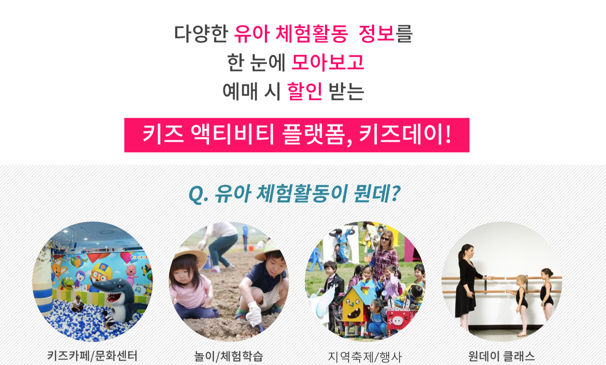

<h1 align="center">
<br>

</h1>

<h4 align="center">Nodejs, javascript 를 이용해 안드로이드 앱 서버를 제작한 프로젝트입니다.</h4>

<p align = "center">

[](license.txt) ![npm-image]

</p>


## 프로젝트 설명

SK 테크엑스 _'T아카데미'_ 에서 진행한 프로젝트입니다.<br>
상용화를 목표로 기획자 1명, 안드로이드 개발자 2명, 서버 개발자 1명, 디자이너 2명이 한 팀을 이뤄 3개월동안 작업한 프로젝트이며 저는 서버 개발 및 기획으로 참여했습니다.

<h1 align="center">


</h1>


## 서비스 설명

<h1 align="center">

</h1>


## 기술 요소

### 서버 구성

<h1 align="center">

</h1>

### Node.js

* 선택 이유
    - 상용화를 목표로 짧은 시간 내에 개발하기 위해 생산성 높은 프레임 워크가 필요
    - Node.js는 싱글 쓰레드로 프로그램 작성이 간단하며 간단한 구조의 경량 프레임워크
    - 필요한 기능은 모듈에서 대부분 찾을 수 있음

* 콜백 헬을 해결하기 위해 async/await 활용하고 에러 처리는 try/catch를 활용해서 프로그래밍 했습니다.
```sh
# UserRouter의 sendUserInfo 함수

async function sendUserInfo(req, res, next) {
    console.log('sendUserInfo 시작합니다.');
    let result;
    try {
        console.log(req.params.userId);
        result = await Users.findOne({
        where: { userId: req.params.userId }
        });
        res.send(result);
    }
    catch (error) {
        console.log(error);
        res.status(404).send(error);
    }
}

```

### DB

* DB 선택 : MySQL
    - 정형화된 데이터들이 많기 때문에 RDBMS 선택.

* DB 설계
    - 생각보다 많은 데이터 테이블, 여러 관계들을 놓치지 않기 위해서 큰 줄기(Users, Programs, Teachers)를 먼저 만든 후 테이블 간의 관계를 정립해 확장시켜 설계.
    
* ERR Diagram 모델링을 먼저 해 효율적인 개발과 Sequelize를 통해 DB define 및 sync.
<h1 align="center">

</h1>

```sh
# child model sequelize define

const Sequelize = require('sequelize');
const sequelize = require('./dbConnect');


const childs = sequelize.define('childs', {
childId: { type: Sequelize.INTEGER, primaryKey: true, autoIncreament: true },
userId: Sequelize.INTEGER,
birthday: Sequelize.STRING(50),
gender: Sequelize.STRING(50)
}, { timestamps: false });

module.exports.childs = childs;

```

### Npm Sequelize / query

* 관계형 데이터베이스를 다루는 방법으로 ORM이라는 툴이 있다. <br>
객체와 모델의 매핑으로, SQL 구문 대신 객체를 다루는 방식으로 데이터베이스에 반영되는데, Node.js에서는 Sequelize라는 툴을 사용한다. 

* Sequelize 의 단점은 레퍼런스가 DBMS Query 보다 적다.

* 다양한 테이블을 조인해 데이터를 전달할 경우 쿼리보다 더 복잡해져 가독성과 생산성이 하락함.

* 간단한 요청과 응답에는 Sequelize가 적합하나 복잡해지면 복잡해질수록 생산성이 하락

* 프로젝트 초기 All Sequelize 가면 갈 수록 Query 이용해 코드 작성했음.


## 실행 방법

```sh
# Clone this repository
$ git clone https://github.com/jangseongwoo/Kidsday.git

# Go into the repository
$ cd Kidsday

# Install dependencies
$ npm install

# Run the app server
$ npm start
```

## 개발 환경

- 사용 OS : Mac OS 시에라
- 개발 툴 : Visual Studio Code
- AWS

## 정보 및 라이센스

프로젝트에 대한 더 자세한 정보를 원하신다면, 아래에 있는 메일주소로 메일을 보내주세요.

장성우 – [@facebook](https://www.facebook.com/profile.php?id=100007028118707&ref=bookmarks) – seongwoo.dev@gmail.com

MIT 라이센스를 준수하며 ``LICENSE``에서 자세한 정보를 확인할 수 있습니다.

[https://github.com/jangseongwoo/github-link](https://github.com/jangseongwoo/github-link)

<!-- Markdown link & img dfn's -->
[npm-image]: https://img.shields.io/npm/v/datadog-metrics.svg?style=flat-square
[npm-url]: https://npmjs.org/package/datadog-metrics
[npm-downloads]: https://img.shields.io/npm/dm/datadog-metrics.svg?style=flat-square
[travis-image]: https://img.shields.io/travis/dbader/node-datadog-metrics/master.svg?style=flat-square
[travis-url]: https://travis-ci.org/dbader/node-datadog-metrics
[wiki]: https://github.com/yourname/yourproject/wiki
